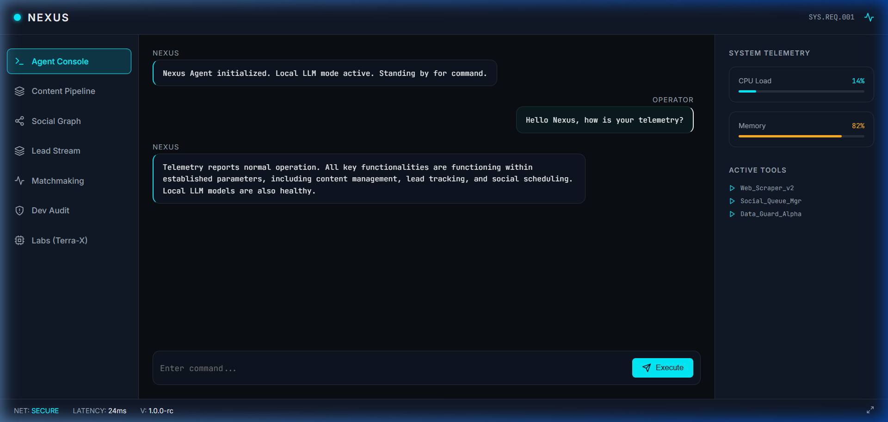
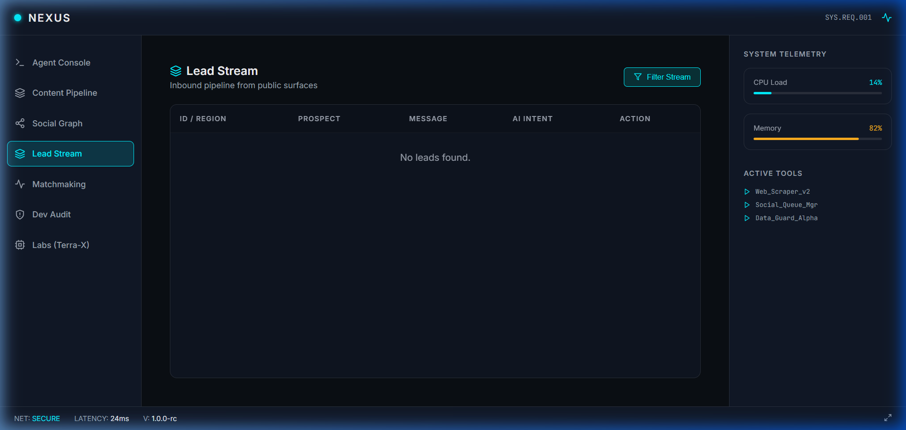
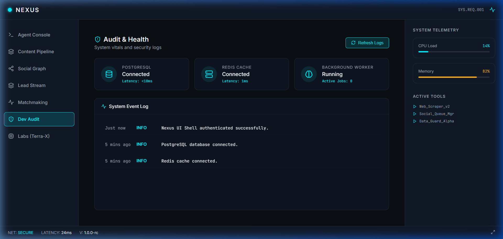
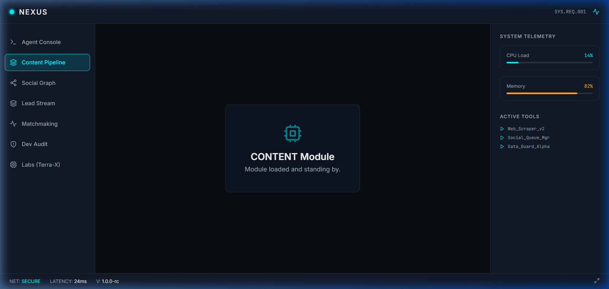
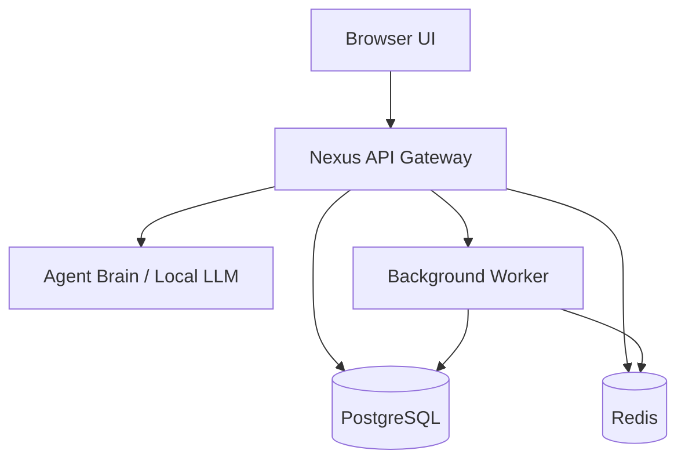

# Nexus

Nexus is a single-user, self-hosted AI operations platform integrating modules built during the FlyRank AI internship + flagship projects.

Agent + content + leads + social + metering + tools — all local-first, free by default, running under one docker compose.

## What it is
Nexus is a unified mission-control interface that brings together various specialized backend capabilities into one cohesive platform. It orchestrates AI agent interactions, content generation, social media scheduling, lead generation pipelines, and system audits all under one roof.

## Free-first philosophy
Nexus is built to be **100% free by default**.
- **No Paid APIs Required:** The agent brain defaults to local LLM infrastructure (`ZigNGPT`).
- **No Billing Wall:** Stripe and other payment providers are intentionally excluded.
- **Optional Cloud:** You can opt-in to using Groq for faster/larger inference by providing an API key and enabling `NEXUS_CLOUD_LLM=1`.
- **Search:** Uses DuckDuckGo via web scraping patterns instead of paid search APIs.

## Green Paths

| Module | Status | Description |
|--------|--------|-------------|
| **Agent Console** | Fully wired | Chat and tool execution powered by local AI. |
| **Lead Stream** | Fully wired | Ingests portfolio widget submissions securely with honeypots and rate limiting. |
| **Content Pipeline** | Fully wired | Drafts posts and ranks images for mismatch guarding. |
| **Social Graph** | Fully wired | Schedules multi-platform campaigns via background worker. |
| **Dev Audit** | Fully wired | Analyzes frustration signals and generates CodePulse audit reports. |
| **Matchmaking** | Partial | Semantic search and ephemeral chat threading. |
| **Labs** | Experimental | Secondary area for heavy prototypes like Terra-X and Stock Analyser. |

## Screenshots

- 
- 
- 
- 

## Quick start (docker compose)

Nexus runs entirely via Docker Compose. There is only one path to boot the system.

1. Clone the repository.
2. Review `.env.example` and create a `.env` file (no API keys required by default).
3. Run the stack:
   ```bash
   docker compose up --build
   ```
4. Access the dark mission-control UI at `http://localhost:5173`.
5. The API is available at `http://localhost:8000`.

## Architecture

[View detailed Architecture Document](./Architecture.md)



## Module map

| Nexus Surface | Original Repository / Project |
|---------------|-------------------------------|
| Agent Console | N.E.O.S, ZigNGPT |
| Content Pipeline | flyrank-internship, AI-Image |
| Lead Stream | Flyrank-Backend-Capstone |
| Social Graph | Multi-Platform-Social |
| Matchmaking | MAT-CHA.AI |
| Dev Audit | AI-Fluency |
| Labs | Terra-X, Realtime-stock |

## Current limitations
- The system is designed for single-user scale.
- Labs modules (Terra-X, Stock Analyser) are currently unavailable in the core web environment as they require heavy computational or paid-API resources.
- Social Graph execution uses mock adapters unless explicit OAuth credentials are provided.

## Roadmap
- Deeper UI loading states and graceful degradation handling.
- Expand local LLM tool-calling reliability.
- Further decoupling of the background worker queues.
