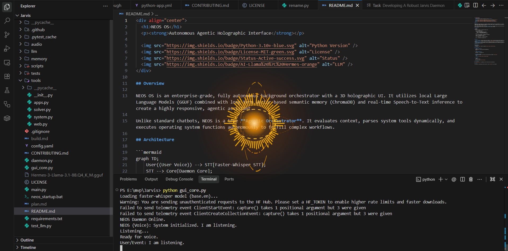
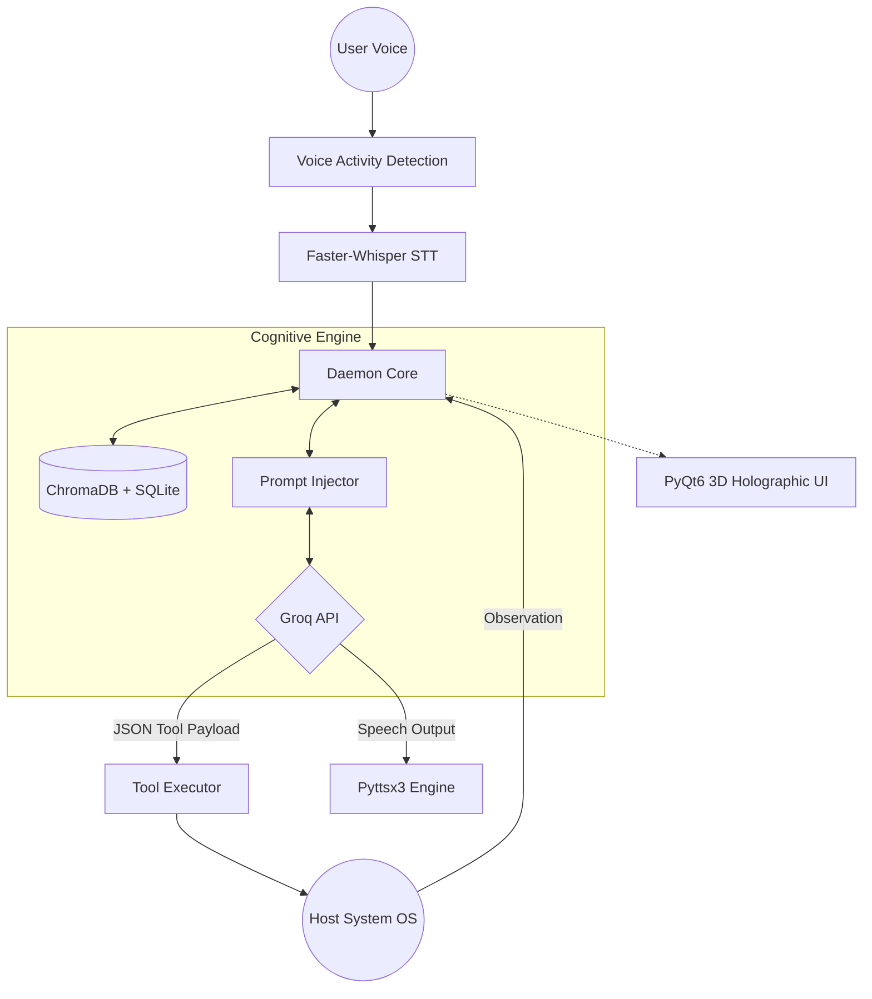

<div align="center">
  <h1>NEOS</h1>
  <p><strong>Autonomous Agentic Holographic Interface</strong></p>

  <a href="https://github.com/NivedhN160/N.E.O.S/actions/workflows/ci.yml">
    
  </a>
  
  
  
  
</div>

## Description
NEOS (Neural Executive Operating System) is an open-source autonomous AI orchestrator. It features a persistent memory system, semantic tool calling, and a seamless Voice Activity Detection (VAD) interface, all accessible via an audio-reactive 3D holographic GUI. Inference is powered by the blazing-fast Groq API, meaning it runs smoothly even on low-end hardware.

<div align="center">
  
</div>

## Features

- **Agentic Autonomy**: Maps natural language to programmatic actions (shell commands, python execution, system APIs) using native JSON tool calling.
- **Continuous Voice Interface**: Features robust Voice Activity Detection (VAD) and STT (`faster-whisper`), for a truly seamless, hands-free experience.
- **Cloud AI Inference**: Powered by the Groq API (Llama 3.3 70B), providing state-of-the-art intelligence with virtually zero local memory footprint.
- **Hybrid Persistent Memory**: Combines SQLite (factual knowledge graph) and ChromaDB (semantic interactions) for true cross-session recall.
- **Holographic GUI**: A multi-axis hardware-accelerated interface built in PyQt6 that visualizes system states and voice waveforms.

## Architecture



## System Requirements

- **CPU**: Any modern processor
- **RAM**: Minimum 4GB (Extremely lightweight due to cloud inference)
- **Supported Platforms**: Windows 10/11, Linux (Ubuntu 20.04+), macOS.
- **Internet**: Required for Groq API and web-search tools.

## Installation

1. **Clone the repository**
   ```bash
   git clone https://github.com/NivedhN160/N.E.O.S.git
   cd N.E.O.S
   ```

2. **Install Dependencies**
   ```bash
   pip install -r requirements.txt
   ```

3. **Configuration**
   Copy `.env.example` to `.env` and add your [Groq API Key](https://console.groq.com/keys):
   ```bash
   cp .env.example .env
   ```
   Open `.env` and set:
   ```env
   GROQ_API_KEY="gsk_your_api_key_here"
   ```

4. **Launch**
   ```bash
   python gui_core.py
   ```

## Roadmap

- [x] Integrate Groq API for zero-cost, lightning-fast inference
- [x] Implement hybrid vector/relational memory store
- [x] Unrestricted Python execution environment
- [ ] Add native integration for standard IoT protocols (MQTT, HomeAssistant)
- [x] Dockerize the daemon core for headless server deployments

## Contributing

Please review `CONTRIBUTING.md` and our `CODE_OF_CONDUCT.md` before submitting pull requests.

## License

This project is licensed under the MIT License - see the `LICENSE` file for details.
